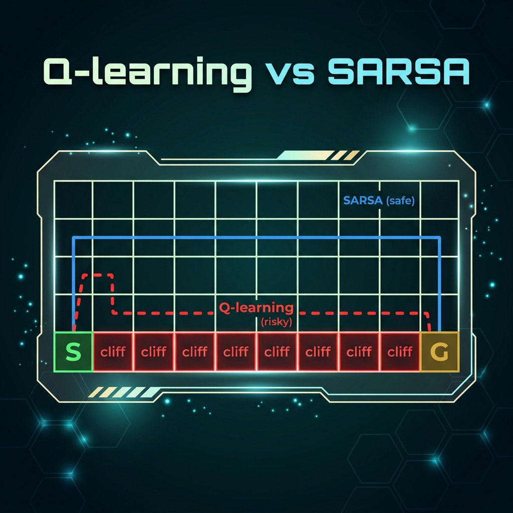
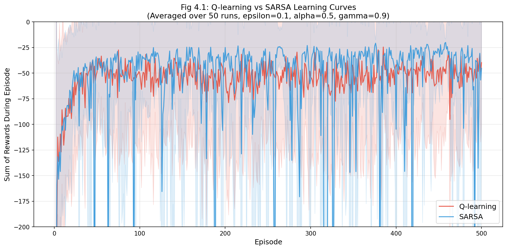
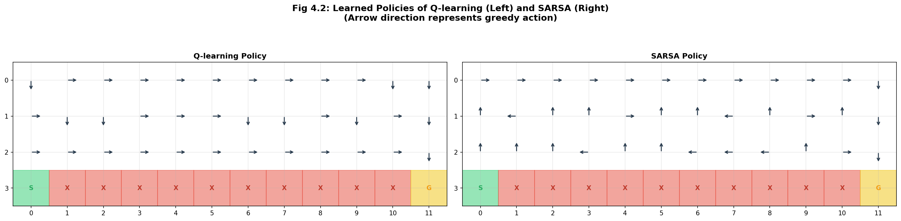

<p align="center">
  
</p>

# HW2：Q-learning 與 SARSA 演算法之比較研究

> Cliff Walking 強化學習實驗報告

## 實驗目的

實作並比較兩種經典強化學習演算法——**Q-learning**（Off-policy）與 **SARSA**（On-policy），透過相同環境與參數設定，深入分析其學習行為、收斂特性以及最終策略差異。

## 環境描述

採用經典的 **Cliff Walking** 環境：

| 項目 | 設定 |
|------|------|
| 網格大小 | 4 × 12（共 48 個狀態） |
| 起點 (Start) | 左下角 (3, 0) |
| 終點 (Goal) | 右下角 (3, 11) |
| 懸崖 (Cliff) | (3,1) 至 (3,10)，共 10 格 |

### 獎勵機制

| 事件 | 獎勵值 | 後續狀態 |
|------|--------|----------|
| 一般移動 | -1 | 下一格 |
| 掉入懸崖 | -100 | 回到起點 |
| 抵達終點 | -1 | 回合結束 |

## 實驗參數

| 參數 | 符號 | 設定值 |
|------|------|--------|
| 探索率 | ε (epsilon) | 0.1 |
| 學習率 | α (alpha) | 0.5 |
| 折扣因子 | γ (gamma) | 0.9 |
| 訓練回合數 | Episodes | 500 |
| 重複執行次數 | Runs | 50（取平均） |

## 檔案說明

| 檔案 | 說明 |
|------|------|
| `cliff_walking_experiment.py` | 主程式：環境、Q-learning、SARSA、視覺化 |
| `HW2_Report.docx` | 完整實驗報告 |
| `fig4_1_learning_curves.png` | 學習曲線圖 |
| `fig4_2_policies.png` | 策略視覺化圖 |

## 快速開始

### 安裝依賴

```bash
pip install numpy matplotlib
```

### 執行實驗

```bash
python cliff_walking_experiment.py
```

執行後將自動產生：
- `fig4_1_learning_curves.png` — Q-learning 與 SARSA 的學習曲線（50 次平均）
- `fig4_2_policies.png` — 兩種演算法學習到的最終策略

## 實驗結果

### 學習曲線



### 策略視覺化



- **Q-learning**：路徑緊鄰懸崖，追求最短路徑（理論最優但高風險）
- **SARSA**：路徑遠離懸崖，選擇安全路徑（在 ε-greedy 探索下實際最優）

### 數據比較

| 比較面向 | Q-learning | SARSA |
|----------|------------|-------|
| 收斂速度 | ≈ 第 25 回合 | ≈ 第 24 回合 |
| 訓練穩定性 | 較差 | 較佳 |
| 策略風格 | 冒險（最短路徑） | 保守（安全路徑） |
| 理論最優性 | 趨近理論最優 | 趨近實際最優 |

## 參考資料

- Sutton, R. S., & Barto, A. G. (2018). *Reinforcement Learning: An Introduction* (2nd ed.). MIT Press.
- Watkins, C. J. C. H., & Dayan, P. (1992). Q-learning. *Machine Learning*, 8(3-4), 279-292.
- [OpenAI Gym Cliff Walking Environment](https://gymnasium.farama.org/environments/toy_text/cliff_walking/)
